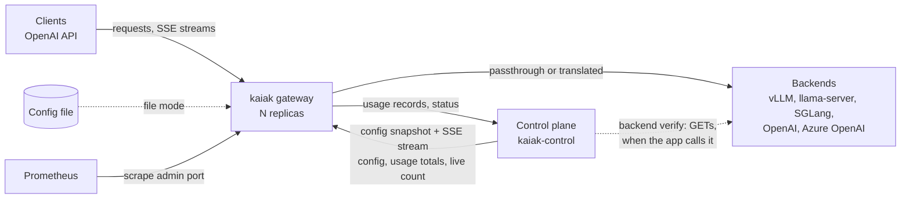
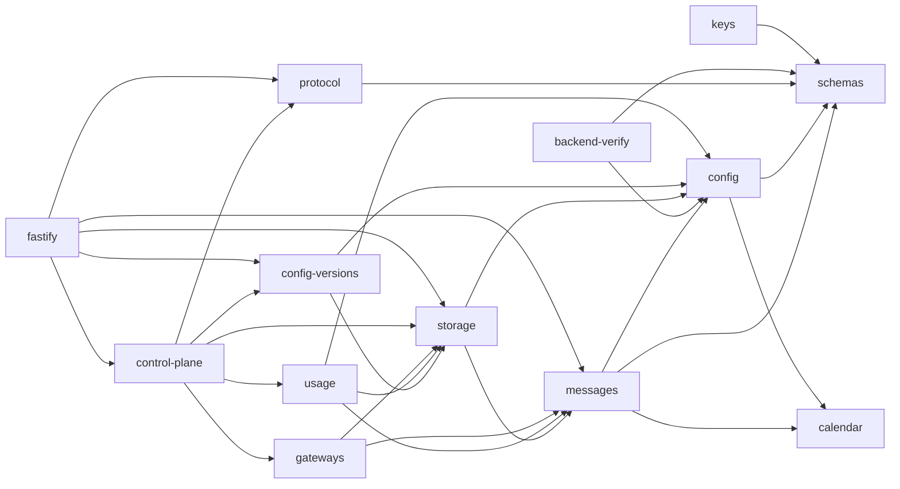
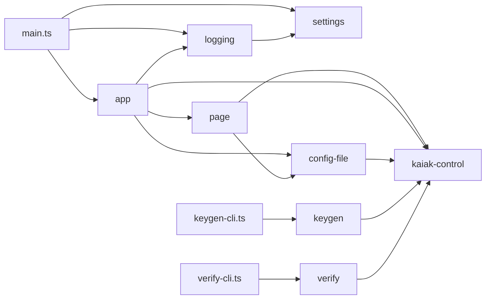

# Architecture

> Module boundaries, data flow and deployment shape. Principles in `docs/kaiak.md`;
> subsystem contracts in `docs/specs/`; stack choices in `docs/TECH-STACK.md`. Update
> this file when the shape changes.
>
> Illustrated overviews: `docs/architecture/gateway.html` (gateway internals) and
> `docs/architecture/control-plane.html` (gateway ↔ control plane). Building a control
> plane on `kaiak-control`: `control/kaiak-control/GUIDE.md`.

## Two halves and a contract

- **`gateway/`** — the product: the `kaiak` binary (Go, standard library only). Serves
  client traffic from a config file or from a control plane, never waiting on one.
- **`control/`** — the control-plane side: `kaiak-control` (the reusable library) and
  `sample` (a thin app on it). Never in the request path.
- **`protocol/`** — JSON Schemas and shared fixtures for the config document and every
  protocol message. It is the contract: both halves run the same fixtures in their test
  suites, so neither can drift alone.

## Data flow

- Client → gateway → backend is the only request path. The control plane feeds it
  config and receives usage and status in the background; a gateway with no control
  plane reachable keeps serving (file mode; in control-plane mode once booted, or
  from the seed config at boot) — except models under a USD limit, refused once the
  outage passes its grace.
- The control plane reaches a backend only when the app verifies one
  (`verifyBackend`, `docs/specs/BACKEND-VERIFY.md`): a few `GET`s to read what it
  reports about its models, off the request path, never on a schedule.
- Budgets are shared through totals, not allowances: each gateway enforces the
  control plane's pushed totals plus its own usage not yet counted, and divides
  per-minute limits by the live-gateway count (`docs/specs/CONTROL-PROTOCOL.md`,
  Budgets).
- Metrics and usage records are separate paths (`docs/kaiak.md`, principle 7).

## Deployment shape

- **Gateways**: N identical, stateless replicas behind one Service (a Deployment on
  Kubernetes): read-only filesystem, no volume, only the control plane's URL and
  token required. Usage not yet acknowledged waits in memory; the drain delivers it.
  A seed config (free local models) covers a boot while the control plane is
  unavailable; with no config at all a gateway exits and is restarted. Opt-in: a
  data directory per replica (cache and spool — last-known-good config, totals
  cache, unsent usage — locked to one process), which needs a volume per pod and a
  stable instance ID (settled 2026-09-25; `docs/specs/GATEWAY.md`, Configuration
  sources).
- **Control plane**: one process per store (a store lease enforces it), never in the
  request path.
- **Admin port** (`9090`: probes, `/metrics`) stays inside the cluster; only the API
  port (`8080`) is exposed to clients.
- Details, sizing and alerts: `docs/DEPLOYMENT.md`.

## Gateway packages

The binary is `gateway/cmd/kaiak`; it builds the dependency graph and owns shutdown.
Subsystems are a flat list of packages under `gateway/internal/`, each added by the
step that first needs it. Go's `internal/` visibility and its ban on import cycles
enforce the boundaries.

- `config` — the config document: strict decoding, validation, resolution into an
  immutable snapshot (each group's path, effective allowed models and limits —
  `child_defaults` merged, `"*"` resolved), the holder that swaps
  it atomically, the one apply path every source uses (validate, swap, log, count),
  and the file-mode loader (startup and SIGHUP reload).
- `server` — the API and admin listeners (health, readiness, `/metrics`), the drain
  (admission, in-flight count, the shutdown sequence `cmd/kaiak` triggers on
  SIGTERM/SIGINT) and the request pipeline: a fixed ordered list of stages over one
  per-request struct (admission → auth → key concurrency → inbound → model access →
  model parameters → limits → attempts), plus the model endpoints' answers. The attempts stage is
  routing → accounting → provider run once per attempt: an attempt that failed before
  anything reached the client is retried — through all three again, the queue
  included — on another deployment when there is one; limits reserve once per client
  request and settle the sum of its attempts' records. Work that must happen however
  a request ends (the last attempt's slot release and circuit report, usage
  settlement, ops metrics, the log line) runs in request finishers.
- `auth` — key hash lookup (key → key ID, group and its path) and the one
  model-access check.
- `routing` — model name → deployment: least in flight among the eligible
  deployments (circuit closed) whose backend has a free slot, ties taking turns;
  owns the per-deployment and per-backend in-flight counts, the per-backend caps and
  the per-deployment circuit breakers (all of which outlive config reloads that keep
  the deployment), and one FIFO queue per model for requests that find no free slot.
  A single dispatcher under routing's lock hands each freed slot to the
  longest-waiting request that can use it; a waiting request blocks on its own
  channel under its request context (no goroutine of its own). A retry passes what
  its earlier attempts rule out (`Avoid`: deployments tried, deployments refused) and
  routing chooses — and dispatches — around them. `server` classifies each attempt's
  outcome and reports it on the attempt's slot (and, by the same classification, to
  the ops metrics); a circuit that
  opens starts one prober per backend (goroutines owned by `RunProbers`, which
  `cmd/kaiak` runs until shutdown) calling the probe function it was given —
  `provider`'s models-list probe, so routing never talks to a backend itself.
  `ProbeNow` is the probe mechanism; the prober's timer is one trigger of it; a
  successful probe (listing the deployment's model) makes a circuit half-open, and
  the one trial request it admits closes it at its first data event or re-opens it
  when it fails first; the prober keeps probing half-open circuits (a failed probe
  re-opens them). Its `ModelChecker`
  (goroutine run by `cmd/kaiak`) probes each applied config's backends once, off the
  request path, and warns about deployments whose model is not listed.
  `cmd/kaiak` hands it each applied config's caps and circuit setting, the
  live-gateway count of each totals message (caps split among live gateways), wires its
  serving-change hook (queue empty/non-empty, circuit open/closed) to the status
  reporter, and its circuit events to `metrics` through an observer interface
  `routing` defines.
- `provider` — the only code that talks to backends: a module per backend type
  (openai-compatible, azure-openai) over a shared OpenAI wire core, passthrough body
  edits, per-backend connection pools, the circuit breaker's probe (`GET …/models`);
  it reads backend streams with `sse`. It returns response events in the client's format; `server`
  relays them to the client, and observers (accounting) read them on the way.
- `accounting` — meters each attempt's response as it is relayed, settles usage and
  cost into usage records (each naming the key's group path) — one per routed
  request, plus one per retried attempt whose request reached the backend and got
  no answer — clamps them to the
  protocol's bound, hands each in control-plane mode to the control client's batch
  sender (the batcher, which tags it with its batch's usage generation), then to a
  fan-out of sinks (usage metrics).
- `limits` — one window counter per limit of global and of each group (sliding
  minute, UTC hour, UTC month); a request is checked against global and every group
  on its key's path, following the live config; check-and-reserve before routing,
  settlement from the request's usage records in a finisher; the file-mode usage snapshot through
  `state`. In control-plane mode: hour and month windows over the pushed totals plus
  the gateway's own usage not yet counted (tagged by the usage generation each
  record carries), totals applied only to the config they were computed under,
  per-minute shares from the live-gateway count, the outage refusal for priced
  money-limited models (no contact, or usage batches unanswered, past the grace), and
  the last applied totals kept in `state` across restarts. It knows nothing of the
  protocol: `cmd/kaiak` converts the client's totals updates and contact.
- `metrics` — a small registry (counters, gauges, fixed-bucket histograms, gauges read
  at scrape time) and its Prometheus text exposition, served on the admin port; the
  ops metrics the `server` pipeline feeds when a request is over; the usage-metrics
  sink on accounting's fan-out. The registry is built in `cmd/kaiak` and passed in.
- `state` — the optional data directory and its files, each carrying a format
  version, written atomically; its lock keeps a second gateway off the directory.
  Without a data directory nothing opens it: `cmd/kaiak` passes none.
- `clip` — bounds a client-controlled string (path, method, model name) before it is
  logged or echoed in an error message; `server` and `auth` use it.
- `sse` — the server-sent events reader (WHATWG format): splits a stream into blocks
  with their raw bytes, data, event name and ID, bounded in size. The provider relays
  backend streams with it; `control` follows the config stream with it.
- `schemacheck` — the parts every document walker is built from: strict JSON decoding
  and checks mirroring the JSON Schemas in `protocol/` (the standard library has no
  schema validator), real-date and real-instant checks. `config` and `control` build
  their walkers on it.
- `control` — the only code that talks to the control plane (a capability fence, as
  `provider` is for backends: no other package opens a connection to it). The
  control-protocol messages: Go types, strict decoding and validation against
  `protocol/schema/`, fixture parity with `kaiak-control` (the usage record is
  `accounting`'s type). The client: boot from the config snapshot, the
  last-known-good copy (through `state`, with a data directory) or, with the control
  plane unavailable, the seed config — else an error `cmd/kaiak` exits on; the
  config stream (read with `sse`) with
  reconnect backoff and resync, every config handed to `config`'s apply path; the
  usage batch sender — accounting's batcher, which only appends in memory and
  returns the filling batch's usage generation, a goroutine sealing batches into the
  batch store — the spool (one file per batch, through `state`) with a data
  directory, memory without (at most `KAIAK_USAGE_MEMORY_BYTES` of encoded records,
  default 64 MiB, held in memory either way:
  sealed ones while the spool cannot be written, queued ones without a spool) —
  another sending them one outstanding at a time; the status reporter (on start,
  on change, on a stream connecting, every 10 s; routing changes at most one a
  second). Totals from stream events and
  usage acks go to one consumer (the limiter), ordered by revision, with the usage
  generations they show counted; the client also tracks contact with the control
  plane (read by the limiter's outage check and the metrics). `cmd/kaiak` wires the
  usage flush and the final status into the drain; `metrics` gets the delivery
  metrics through an observer interface `control` defines, and the connection state
  through one `metrics` defines.
- `fakebackend` — an OpenAI-compatible test backend that can stream, stall, hang, cut,
  fail (also for a scripted sequence of requests) and omit usage on demand, serves a
  models list whose status the test sets, and records every request it receives; used by tests
  only. `fakebackend/cmd/fakebackend` runs it as a process (listen address, behavior
  profile, credential check) for scripts and the live-test kit's self-test.
- `fakecontrol` — a control plane for tests: config snapshot and stream from versions
  the test publishes, the request checks, and scripted events, outages, restarts and
  protocol versions; takes usage batches (de-duplicated by batch ID as the protocol
  settles, with scripted failures: error answers, acks dropped after counting) and
  status reports; scripted totals (windows, live count) under a revision and
  per-instance `counted_through`, optionally pushed on every change; records every
  request. Tests only; it imports nothing from the gateway, so `control`'s own tests
  use it.

Test tooling outside the binary:

- `gateway/e2e` — the end-to-end test: builds `kaiak`, runs it as a subprocess with a
  generated config against the fake backend, drives it over HTTP and signals (reload,
  restart, drain); in control-plane mode against `fakecontrol` (boot, pushed config,
  usage batches delivered, a killed gateway resending its spooled batch with the
  same ID, the drain flushing the last records, last-known-good restart), two
  gateways sharing one `fakecontrol` (per-minute shares, a budget spent through one
  enforced on the other, the outage refusal and recovery), and routing reliability
  with one model on two fake backends (`reliability_test.go`: retry on the other
  deployment after a refused connection, a `500`, a `429`, a stream's first-event
  timeout; a non-stream response timeout answered at once;
  the circuit opening, a probe half-opening it and its trial closing it; capped
  backends queueing, `queue_full`, `queue_timeout`, a queued request served during
  the drain), the binary's timeouts on real sockets (`timeouts_test.go`: body-read,
  idle and write deadlines from the environment, a stalled stream counted toward the
  circuit), every metric series at 0 from startup and each config apply
  (`zeroseries_test.go`), and the stateless
  gateway (`stateless_test.go`: the minimal setup — control plane URL and token
  only, a read-only working directory — the boot order with the seed and the exit
  without a config, a priced seed refused, the drain's flush reserve delivering a
  cut stream's record). Part of `go test ./...`.
  Built only with the `crosshalf` tag, `TestAcrossHalves` (`sample_test.go`) is the
  cross-half e2e: the real sample control plane (`node control/sample/src/main.ts`)
  and two `kaiak` processes, the control-plane traffic through an in-test proxy
  (`proxy_test.go`: a fixed address while the sample stops and restarts on another
  port, one usage ack it can lose after the sample counted the batch, and every
  status report it forwarded with the sample's answer). It reads the sample's totals
  from the protocol's own stream (an observer instance decoding `totals` events),
  what the sample received as status (an open circuit, a queued model) from the
  reports the proxy forwarded and the sample accepted, and the gateways' state from
  logs, metrics and headers. Needs Node and `control/`'s dependencies, so `go test ./...` leaves it out
  and `scripts/check-all.sh` runs it.
- `scripts/live` — the live-test kit, a separate Go module (standard library only,
  imports nothing from the gateway): generates a config for a real vLLM, Azure OpenAI
  or OpenAI backend — or two backends serving one model (load spread, the cap, a
  failover the user drives) — runs the built binary and checks it end to end
  (`docs/testing/LIVE-BACKENDS.md`).

## Control-plane packages

- npm workspaces under `control/`: `kaiak-control` and `sample`. Each package exposes
  one entry (`src/index.ts`, set by its `exports`).
- Inside a package, a subsystem is a top-level folder under `src/`. Code outside a
  subsystem imports it only through its `index.ts`, and the import graph is acyclic —
  enforced by `control/scripts/check-boundaries.ts` in `npm run lint`.
- `kaiak-control` subsystems:
  - `schemas` — loads every JSON Schema of the package's `schema/` (a byte-for-byte
    copy of `protocol/schema/`, `npm run sync-schemas`) into one validator
    (cross-file `$ref`s resolve by `$id`) and turns violations into issues.
  - `calendar` — real-date and real-instant checks, the part of a timestamp a schema
    pattern cannot check.
  - `config` — validates a config document: the shared schema from `protocol/`, then
    the semantic rules (`docs/specs/CONTROL-PROTOCOL.md`, Config — the group tree
    included); resolves each scope — global and every group — to its path,
    effective limits and allowed models (`child_defaults` merged, down the path),
    as the gateway's config snapshot does.
  - `messages` — validates each control-protocol message: its schema, then the
    message rules (`docs/specs/CONTROL-PROTOCOL.md`, Messages); one validator per
    message.
  - `storage` — the storage interface every piece of control-plane state goes
    through (async, so a database implements it) and the in-memory store, its
    reference implementation and the sample's store. The store owns the config
    epoch, the lease that keeps it to one control-plane process, and the conditional
    batch write that makes counting exactly-once.
  - `config-versions` — publishing (validate, refuse a changed group parent, then
    store as the next version),
    the current version, resuming from a version within the bounded history or
    `resync`, and subscriptions to published versions.
  - `usage` — usage intake and totals (`docs/specs/CONTROL-PROTOCOL.md`, Usage
    intake): validates a batch, de-duplicates it by the instance's last counted batch
    ID (one batch at a time per instance, the store's write conditional on that ID),
    stamps it with the receipt time, adds each
    record to the hour and month windows of global and each group of its path the
    current config still defines (the
    record's `gateway_time` window when that is the current or previous one), and
    answers the ack with the totals of the current windows; recent records; a
    subscription to counted batches for pushes. Totals are made per gateway
    (`counted_through`) under a per-process revision, and counting, publishes and
    totals reads take turns so each message is a consistent snapshot; a publish
    carries a model-set-edited limit's spend to its new identity in its turn.
  - `gateways` — gateway status and the live set (`docs/specs/CONTROL-PROTOCOL.md`,
    Status intake): validates a status, keeps the latest per instance with its
    receipt time, joins the instance to the live set, flags two processes sharing an
    instance name; the expiry sweep (an invocable run plus its scheduling timer)
    drops silent gateways from the set, forgets long-silent ones and drops batch
    cursors past their retention (7 days by default); a subscription to
    changes, telling whether the live count moved.
  - `keys` — key generation and hashing (Config, key format).
  - `backend-verify` — `verifyBackend`, the only code in `control/` that talks to a
    backend (`docs/specs/BACKEND-VERIFY.md`): checks that it answers and accepts the
    credential, and reads what it reports about its models (vLLM's list, llama-server's
    `/props`) into a report the app turns into declared config. Input checked with the
    config schema's rules; answers with lenient schemas of its own. Called by the app
    only — not by `control-plane` or `fastify`.
  - `protocol` — the checks every gateway request passes (token, protocol version,
    instance) as framework-agnostic functions returning structured errors with the
    status an adapter answers with; the protocol version and header names.
  - `control-plane` — the core the host app builds (`createControlPlane`): store,
    token, clock, history and recent-records sizes, live-set timings in; the
    operations of the subsystems above out, the live set's size wired into totals;
    `start`/`stop` take and give up the store's lease and run the expiry sweep.
    HTTP adapters and the host app use it; it knows nothing of HTTP.
  - `fastify` — the HTTP adapter: a Fastify plugin (`controlProtocolPlugin`) the host
    registers with a core instance. It mounts the gateway endpoints (default under
    `/v1`), runs the request checks and adds the protocol header on every response,
    answers the config snapshot, and writes the stream straight to the socket
    (subscribe, replay, live config pushes, totals coalesced per stream and held for
    slow readers, heartbeat, the stall bound); takes usage batches and statuses;
    starts the core with the app and stops it on close. Routes only — logging and the rest of
    the app are the host's.

- `sample` subsystems (the app wiring lives in its process entries, `src/main.ts`,
  `src/keygen-cli.ts` and `src/verify-cli.ts`):
  - `settings` — the process settings read from the environment.
  - `logging` — the Fastify logger option per log format.
  - `config-file` — the config source: reads the file and publishes it through the
    core; the reload is an invocable run (startup and a debounced watch on the file's
    directory are its triggers — the file's own entry, and the `..`-prefixed entries a
    Kubernetes ConfigMap volume swaps atomically), recording each run and keeping the
    latest failure until a run succeeds.
  - `app` — `createSampleApp`: the Fastify instance, the core on the in-memory store,
    the plugin mounted, the status page registered, the config file read on ready and
    watched until close (each run also told to the page), the core's listener
    failures and expiry sweeps logged; a warn line at startup says the state is in
    memory (budgets, totals and batch de-duplication reset on restart).
  - `page` — the read-only status page: `GET /` renders four sections (gateways,
    config with the group tree, totals vs limits per scope, recent usage by group
    path) from the core and the config file's
    state, server-side, escaped by default (`html` template tag); `GET /events` is
    one SSE stream per browser — every section on connect, then each changed section
    re-rendered and pushed as `event: section` (`{id, html}`), coalesced to at most
    one push per second, applied by a small inline script. At most 32 page streams
    are open at once (they share the port with the gateways' config streams and take
    no key); one more is refused `503 page-streams-full` (settled 2026-09-25, N-S6).
    The page subscribes to
    the core only while a browser is connected; `preClose` ends its streams. No
    authentication (local and demo use); key IDs only; backend URLs shown without
    userinfo; a notice leads the page: state is in memory and resets on restart, not
    a billing system.
  - `keygen` — the keygen command: arguments in, the key, its ID, its hash and the
    `keys` entry (`{ hash, group }`) out, through `kaiak-control`'s `createKey`.
  - `verify` — the verify command: arguments in (the API key read from the variable
    `--api-key-env` names), `kaiak-control`'s `verifyBackend` report out as JSON on
    stdout, the metadata to merge and what is left to decide on stderr.

