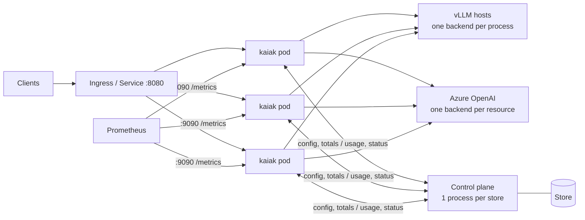

# Deployment

> The operator's guide: running kaiak for real — several gateway replicas on
> Kubernetes in front of many vLLM hosts and Azure OpenAI, fed by one control plane.
> It says what to set and why; the contracts it relies on live in
> `docs/specs/GATEWAY.md` and `docs/specs/CONTROL-PROTOCOL.md`, linked rather than
> restated. Kubernetes manifests are not part of this repo (the cluster setup is the
> operator's, `AGENTS.md` → Deployability); this guide names the fields they need.
> Local runs and image commands: `README.md`.

## Topology



- **Gateways**: N identical, **stateless** replicas — a Deployment behind one
  Service. Clients reach them through an ingress or the Service on the API port
  (`8080`). The admin port (`9090`) is never routed through an ingress.
- **Control plane**: exactly **one process per store**, `replicas: 1`, and a
  `Recreate` update strategy (a rolling update briefly runs two). The config version
  order, the totals revision and the live-gateway set live in one process; a second
  process on the same store refuses to start (`store-lease-held` — the store lease,
  `CONTROL-PROTOCOL.md` → Control-plane processes). Running gateways never wait on
  it: an outage does not stop traffic (Control-plane outages, below) — but a
  gateway **starting** needs it, or a seed config (Boot).
- **The sample control plane is not a billing system.** Its store is in memory:
  budgets, usage totals and batch de-duplication reset every time it restarts (it
  says so in its log and on its page). Use it to validate the deployment. For real
  budgets, a control plane built on `kaiak-control` implements the storage interface
  (`control/kaiak-control/src/storage/types.ts`) on a durable store — including the
  lease and the conditional batch write.
- **File mode is single-replica.** Without a control plane every replica enforces
  every limit and every backend cap in full — N replicas admit N × each limit. Run
  file mode as one gateway, or use a control plane.

## The minimal gateway

A gateway needs **only** `KAIAK_CONTROL_URL`, `KAIAK_CONTROL_TOKEN` and the API-key
variables its config names (`GATEWAY.md` → Configuration sources: the minimal
gateway). No volume, no seed, no data directory: it writes nothing anywhere, so the
root filesystem is read-only. The fields a manifest needs:

| Field | Setting | Why |
|---|---|---|
| Workload kind | **Deployment**, `replicas` ≥ 2, `rollingUpdate` with a small `maxSurge` and `maxUnavailable: 0` | Nothing ties a pod to its node or its past: any pod can replace any other. |
| Image | `<registry>/kaiak:<tag>` or a digest, never `latest` | The tag is the version `kaiak_build_info` reports. |
| Ports | `8080` (API, behind the Service) and `9090` (admin: probes, metrics) | The admin port stays off the ingress (Observability). |
| Environment | `KAIAK_CONTROL_URL`; `KAIAK_CONTROL_TOKEN` from a Secret (`secretKeyRef`); one variable per `api_key_env` the config names, from Secrets; `GOMEMLIMIT` (Resources) | The whole configuration of a minimal gateway; every other variable (Environment) is optional. |
| Volumes | **none** | The gateway writes nothing. |
| Pod `securityContext` | `runAsNonRoot: true`, `runAsUser: 65532`, `runAsGroup: 65532`, `seccompProfile: {type: RuntimeDefault}` | The image's user (`USER 65532:65532`). |
| Container `securityContext` | `readOnlyRootFilesystem: true`, `allowPrivilegeEscalation: false`, `capabilities: {drop: [ALL]}` | Nothing to write, no privilege needed: ports above 1024. |
| Startup probe | `GET /healthz` on 9090, `periodSeconds: 2`, `failureThreshold: 35` (70 s) | Covers the boot wait (60 s by default) before liveness applies: Probes, below. |
| Readiness probe | `GET /readyz` on 9090, `periodSeconds: 5` | Probes, below. |
| Liveness probe | `GET /healthz` on 9090, `periodSeconds: 10` | Probes, below. |
| Resources | memory request = limit (1.5 GiB at the default body budget); a CPU request, no tight CPU limit | Resources. |
| `terminationGracePeriodSeconds` | grace + drain timeout + 10 s: **75** at the defaults | Draining. |

- **The securityContext passes the `restricted` Pod Security Standard.** The image
  declares a numeric user, so `runAsNonRoot` verifies even without `runAsUser`.
  No `fsGroup` is needed: there is no volume.
- **Instance ID**: leave `KAIAK_INSTANCE_ID` unset — it defaults to the hostname,
  the pod name. Every pod is a new instance with a fresh usage epoch; never copy one
  value to two replicas (the control plane flags it: `started-at-alternating`).
- **Rollouts** do not wait for drains: old pods drain while new ones serve. Each old
  pod stays in the control plane's live set until 30–35 s after its last status
  (`CONTROL-PROTOCOL.md` → Status intake), so per-minute shares and backend-cap
  shares shrink for a moment during a rollout — keep `maxSurge` small.
- **Probes** (admin port; neither needs a credential, also with
  `KAIAK_METRICS_TOKEN` set): `GET /readyz` → `200 ready`, `503 draining`;
  `GET /healthz` → `200 ok`, through the whole drain. The listeners bind only once a
  config is in force and the first totals have arrived (Boot, below), so a pod is
  ready from its first successful probe — and until then **every probe, liveness
  included, finds the port closed**. Startup normally takes well under a second,
  but while the control plane is unavailable it takes up to
  `KAIAK_CONTROL_BOOT_WAIT_MS` (60 s) before the gateway binds on its seed or
  last-known-good config, or exits. Give it a **startup probe** on `/healthz` that
  allows the boot wait plus margin — `periodSeconds: 2`, `failureThreshold: 35`
  (70 s) at the default — so the liveness probe never restarts a pod that is still
  waiting; with a shorter or longer boot wait, scale `failureThreshold` with it
  (wait ÷ period + a few). Without a startup probe, the equivalent is
  `initialDelaySeconds` on the liveness probe above the boot wait (70), which also
  delays liveness for every healthy start.

## Boot

`GATEWAY.md` → Control-plane mode: Boot has the full table. In short:

- The gateway fetches its config from the control plane. While the control plane
  is **unavailable** (down, timing out, any `5xx`, `503 config-unavailable` before
  the first publish) it asks again every 0.25–2 s (jittered) for up to
  `KAIAK_CONTROL_BOOT_WAIT_MS` (default 60 s); the first failure logs `config
  snapshot not fetched at startup: retrying within the boot wait`.
- With the config, it waits for the **first totals** (normally milliseconds: they
  follow the config on the stream) so it never serves a spent budget as unspent,
  then binds and serves (`waiting for the first totals` → `first totals
  received`). If the rest of the boot wait passes without them, it binds anyway
  and logs `first totals not received within the boot wait: priced USD-limited
  requests are refused until they arrive`: until they come, priced models under a
  `usd_per_month` limit answer `503 budget_unavailable`; everything else serves.
- **Unavailable through the whole wait**: it uses the seed config if one is set
  (Optional: the seed config), else **exits non-zero** with one log line (`no
  config: control plane unavailable and no seed config …`). Kubernetes restarts it
  with its backoff (`CrashLoopBackOff`, growing to 5 minutes between tries) — a pod
  that came back up waits for its next try, not for the control plane.
- **Refused token (`401`), another `4xx`, or a config the gateway rejects**: it
  exits at once, seed or not — no retry. These are errors to fix, not outages to
  ride out: the log line names the cause (`… answered 401 unauthorized …`, `…
  config version N was rejected (codes …)`).
- **During a control-plane restart** (a rollout, a crash, a node drain — back
  within the minute): running pods keep serving and reconnect on their own. A pod
  starting meanwhile shows `retrying within the boot wait`, stays unready (the
  admin port is closed), and binds within a second of the control plane answering
  — no crash loop. `kaiak_control_connected` of the running pods drops to 0 and
  returns.
- **Consequence**: during a control-plane outage longer than the boot wait, running
  pods keep serving, but a pod that restarts, is rescheduled or is added by scaling
  does not start — unless a seed is set. Keep the control plane up, or set a seed.

## Control-plane outages

A running gateway keeps everything in memory and never waits on the control plane
(`GATEWAY.md` → Limits: Control-plane mode; `CONTROL-PROTOCOL.md` → Control-plane
outage):

- It serves on the config in force. Config changes and key revocations do not
  arrive until the stream is back.
- Per-minute limits and backend caps keep their last shares; hour and month limits
  run on the last pushed totals plus local counting.
- **After `global.control_outage_grace_ms`** (default 15 min) with no contact,
  requests for a **priced model under a `usd_per_month` limit** are refused `503
  budget_unavailable`: nobody knows the spend. Free models and models under no USD
  limit keep serving. The first contact ends it. The log says so once each way:
  `control plane outage: priced USD-limited models refused` (warn) and `control
  plane outage over: contact is back` (info).
- **Usage waits in memory, bounded per pod by `KAIAK_USAGE_MEMORY_BYTES`** (default
  64 MiB of encoded records, shown by `kaiak_usage_queued_bytes`): past that, the
  oldest queued batches are dropped, logged at error level and counted in
  `kaiak_usage_dropped_records_total{reason="memory_bound"}`
  (`GATEWAY.md` → Usage batches in memory). **What the default covers**: a typical
  record encodes to about 510 bytes (measured 506 with 32-character record and
  request IDs, a pod-name instance, ordinary key and model names and a short group
  path; a
  client-chosen request ID of up to 128 characters adds up to about 100), so 64 MiB
  holds about 130 000 records:

  | Records/s per pod | Outage the default holds |
  |---|---|
  | 20 | about 110 min |
  | 100 | about 22 min |
  | 145 | 15 min — the default outage grace |
  | 1 000 | about 2 min |

  Records are at least requests: a retried attempt sent in full adds one. Past the
  grace only priced USD-limited models are refused, so free models keep adding
  records for as long as the outage lasts. **To hold an outage of T seconds at R
  records/s**, set `KAIAK_USAGE_MEMORY_BYTES` to about R × T × 520 — 1 000
  records/s through 15 min is about 470 MB, `536870912` (512 MiB) — and add it to
  the memory limit (Resources). Longer outages than that lose billing data unless
  the pods keep a data directory (Optional: the data directory).

## Draining and what a pod loses

**Draining** (`GATEWAY.md` → Lifecycle): on SIGTERM `/readyz` fails; requests are
still accepted for the grace period (`KAIAK_DRAIN_GRACE_MS`, default 5 s — endpoint
removal takes time to reach kube-proxy and the ingress); then new connections are
refused, and in-flight requests, streams included, get the drain timeout
(`KAIAK_DRAIN_TIMEOUT_MS`, default 60 s) **less the flush reserve**
(`KAIAK_DRAIN_FLUSH_RESERVE_MS`, default 10 s, at most half the timeout when unset).
Requests still running then are cut, and their partial usage records go out with
the rest in the reserve. Usage batches keep going out every 5 s throughout the
drain; then a final status (≤ 2 s), the admin listener closes (≤ 5 s for a scrape
still open), with log export on the last queued log lines are sent (at least 1 s),
and the process exits 0. The `draining` log line names the times in
force, in seconds: `kaiak.drain.grace`, `kaiak.drain.timeout`,
`kaiak.drain.flush_reserve` and `kaiak.drain.cut_after` — when requests still
running are cut, counted from the grace's end (the timeout less the reserve; the
whole timeout in file mode).

- **`terminationGracePeriodSeconds` ≥ grace + drain timeout + 10 s**: 75 s at the
  defaults. The Kubernetes default of 30 s kills long streams mid-drain and skips
  the flush. Docker and Compose have the same limit under another name, with a 10 s
  default: `docker run --stop-timeout 75`, `stop_grace_period: 75s` in Compose.
- **Size the drain timeout to the longest request a rollout should let finish, plus
  the reserve.** A thinking model streaming 16k tokens at 30 tokens/s runs about 9
  minutes; a non-stream request can run up to its backend's `response_timeout_ms`
  (default 30 min). To let 10-minute requests finish: `KAIAK_DRAIN_TIMEOUT_MS=610000`
  (600 s + the 10 s reserve), `terminationGracePeriodSeconds: 625`.
- **`preStop` is not needed**: the grace period is the propagation wait, and the
  distroless image has no shell or `sleep` for one. When the path from the endpoint
  change to the last load balancer takes longer than 5 s (a cloud load balancer
  deregistering targets), raise `KAIAK_DRAIN_GRACE_MS` instead.
- A second SIGTERM skips the rest of the drain (requests cut at once, the last batch
  sealed but not waited for, no final status).

**What a pod loses** (no data directory):

| How it ends | Lost usage |
|---|---|
| Drained, control plane answering | nothing |
| Drained, control plane unreachable or slow | what the flush could not deliver — logged at error level, `usage not flushed: lost at exit (no data directory)`, with the batches and records |
| Killed without a drain (OOM kill, node loss, SIGKILL after the grace period) | every record not yet acknowledged: normally the last ≤ 5 s; during an outage, everything queued (up to `KAIAK_USAGE_MEMORY_BYTES`, about 130 000 records at the default) |

Nothing else is lost: config and totals come back from the control plane.

## Resources

- **Memory ≈ 2 × body budget + open streams × ~70 KiB + non-stream `choices` in
  flight + headroom.** Request bodies are bounded by the body budget
  (`KAIAK_BODY_MEMORY_BYTES`, default 512 MiB); peak body memory is about twice the
  budget (the provider's edited copy while an attempt is sent — at most the body plus
  one edit per owned field, since a body repeating a member is refused — plus parse
  garbage; `GATEWAY.md` → Request pipeline: request bodies). **Each open stream**
  keeps about 70 KiB of live heap (measured in the daily-operations review,
  2026-09-25), about 130 KiB of
  resident memory without `GOMEMLIMIT` (the collector lets garbage grow to twice the
  live heap); memory, not CPU, is what runs out first under many streams. Outside
  both, each non-stream answer in flight keeps its `choices` (up to 4 MiB, usually
  KiB) to estimate output when a backend reports no usage. Headroom covers idle
  connections, metrics series, limit counters (about 1.4 KB per effective limit, at
  most about 70 MB: Config for many hosts), the usage queue (up to `KAIAK_USAGE_MEMORY_BYTES`,
  64 MiB; its heap is about its encoded size), with log export on its queue (at most
10 000 records, about 10 MB) and the runtime. Starting point:
  **limit = 2 × budget + 512 MiB** (1.5 GiB at the default budget) with
  `GOMEMLIMIT` set, good for about 5 000 open streams per pod alongside ordinary
  bodies; beyond that add 70 KiB for each stream above 5 000 (10 000 streams: about
  350 MiB more), plus
  whatever `KAIAK_USAGE_MEMORY_BYTES` is raised by above 64 MiB; memory request =
  limit. The body budget is rarely full while thousands of streams run (a body goes
  back to the budget once its response starts relaying), so this is conservative.
  Lower the budget for a smaller pod — 256 MiB serves 64 bodies at the 4 MiB cap and thousands
  of ordinary requests. Then watch the working set under real load.
- **`GOMEMLIMIT`** makes the Go collector work harder before the kernel kills the
  pod. From the downward API (`valueFrom: {resourceFieldRef: {resource:
  limits.memory}}` — bytes) it follows the limit with no
  second number to keep in step, set at 100% of it; a literal value at about 90%
  (`GOMEMLIMIT=1350MiB` for 1.5 GiB) leaves the collector more room. It is a soft
  limit; the body budget is the hard bound on what clients can pin.
- **CPU**: the gateway is I/O-bound (it splices a few fields into bodies and parses
  SSE framing; no tokenizer). Go sizes `GOMAXPROCS` from the container's CPU limit.
  Set a CPU request; a tight CPU limit throttles every stream at once and shows up as
  stream latency — prefer no limit or a generous one.
- **Disk**: none.

## Availability

- **PodDisruptionBudget** for the gateways — `maxUnavailable: 1` (or a
  `minAvailable` that leaves capacity for the load) — so node drains and cluster
  upgrades take pods one at a time, each draining in full. Not for the control
  plane: one replica with a PDB blocks every node drain; its outage is what the
  gateways ride out.
- **Spread the replicas**: `topologySpreadConstraints` over
  `topology.kubernetes.io/zone` and `kubernetes.io/hostname` (`maxSkew: 1`,
  `whenUnsatisfiable: ScheduleAnyway`), or a preferred pod anti-affinity on the
  hostname — one node's loss should not take most gateways, since a pod killed
  without a drain loses its unacknowledged usage.
- **Load-balancer idle timeouts vs the gateway's**: the gateway closes idle
  keep-alive connections after 120 s (`KAIAK_IDLE_TIMEOUT_MS`). A proxy that keeps
  upstream connections idle longer sends requests into connections the gateway is
  closing (sporadic `502`s): keep the proxy's upstream idle timeout below the
  gateway's (ingress-nginx's upstream keep-alive timeout is 60 s). A cloud load
  balancer whose idle timeout you raise above 120 s for long non-stream requests
  (an AWS ALB cuts a request that sends no bytes for its idle timeout, 60 s by
  default) needs `KAIAK_IDLE_TIMEOUT_MS` raised above it too.
- **Private CAs**: backends and the control plane are reached with the system trust
  store. The image sets `SSL_CERT_FILE` to its public bundle; to add a private CA,
  mount its PEM file(s) from a ConfigMap or Secret as a directory and set
  `SSL_CERT_DIR` to it — Go reads both the file and every file in the directory, so
  the public roots stay (Azure needs them). Replacing `SSL_CERT_FILE` instead drops
  the public roots unless your bundle carries them.
- **Monthly budgets reset at the UTC month boundary** (hours are UTC hours too —
  `GATEWAY.md` → Limits): a group whose people work in UTC+3 sees its budget reset at
  03:00 on the 1st.
- **The sample control plane**: `replicas: 1`, `strategy: Recreate`. It has **no
  health endpoint** — use a TCP probe on 8090 for readiness and liveness (its page,
  `GET /`, renders every gateway and spend, heavier than a probe needs). Starting
  resources: 100m CPU, 256 MiB memory (its store keeps a bounded number of recent
  records); watch it. It runs with the same securityContext as the gateway with
  `runAsUser: 1000`, `runAsGroup: 1000` (the image's `USER 1000:1000`),
  `readOnlyRootFilesystem: true` included.

## Environment

Every variable the code reads (verified by grep over `gateway/cmd`, `gateway/internal`,
`control/sample/src`, the Dockerfiles and `scripts/`), except development tooling:
the live-backend kit's `LIVE_*` (`docs/testing/LIVE-BACKENDS.md`) and npm's
`INIT_CWD` (the sample resolves a relative `KAIAK_SAMPLE_CONFIG` against the
directory `npm` ran from; unset in the image, where the working directory counts).
Durations are whole milliseconds; a malformed value is a startup error.

**Gateway** (`gateway/cmd/kaiak/main.go`; contract: `GATEWAY.md` → Configuration
sources):

| Variable | Default | Meaning |
|---|---|---|
| `KAIAK_CONFIG_FILE` | — | File mode: the config file. Not with `KAIAK_CONTROL_URL`. |
| `KAIAK_CONTROL_URL` | — | Control-plane mode: the control plane's base URL (`http(s)://host[:port][/path]`, no query); `https://` outside local runs. Requires `KAIAK_CONTROL_TOKEN`. |
| `KAIAK_CONTROL_TOKEN` | — | The bearer token presented to the control plane (a Secret; shared by all gateways). |
| `KAIAK_CONTROL_BOOT_WAIT_MS` | `60000` | How long boot keeps asking an unavailable control plane for the config before using the last-known-good or seed config, or exiting; what is left of it bounds the wait for the first totals (above 0). Size the startup probe with it (Probes). |
| `KAIAK_SEED_CONFIG_FILE` | — | Control-plane mode only: config for a boot while the control plane is unavailable; free models only, checked completely at startup. |
| `KAIAK_INSTANCE_ID` | the hostname | The gateway's name to the control plane; in control-plane mode a letter or digit, then up to 252 of letters, digits, `.`, `_`, `-`. |
| `KAIAK_DATA_DIR` | — (nothing written) | Opt-in data directory (spool, last-known-good, totals cache, limits snapshot); created if missing; one gateway per directory. |
| `KAIAK_LISTEN_ADDR` | `:8080` | The API listener. |
| `KAIAK_ADMIN_ADDR` | `:9090` | The admin listener (`/metrics`, `/healthz`, `/readyz`). |
| `KAIAK_METRICS_TOKEN` | — (open) | When non-empty, `/metrics` requires `Authorization: Bearer <token>`; probes stay open. |
| `KAIAK_LOG_FORMAT` | `json` | `json` or `text`. |
| `KAIAK_DRAIN_GRACE_MS` | `5000` | Drain: how long new requests are still accepted after SIGTERM (0 or more). |
| `KAIAK_DRAIN_TIMEOUT_MS` | `60000` | Drain: how long in-flight requests get before they are cut (0 or more). |
| `KAIAK_DRAIN_FLUSH_RESERVE_MS` | `10000` (at most half the timeout when unset) | Control-plane mode: the end of the drain timeout kept for the usage flush; in-flight requests are cut that much earlier (0 up to the timeout). |
| `KAIAK_IDLE_TIMEOUT_MS` | `120000` | Idle keep-alive connections are closed after this (above 0). |
| `KAIAK_BODY_READ_TIMEOUT_MS` | `60000` | A request body must arrive within this, else `400 invalid_body` (above 0). |
| `KAIAK_WRITE_TIMEOUT_MS` | `60000` | Each write to a client must complete within this; a client that stops reading is taken as gone (above 0). |
| `KAIAK_BODY_MEMORY_BYTES` | `536870912` (512 MiB) | The body budget (Resources); above 0. |
| `KAIAK_USAGE_MEMORY_BYTES` | `67108864` (64 MiB) | Control-plane mode: the bound on unacknowledged usage held in memory, by encoded size (Control-plane outages); above 0. |
| `KAIAK_MAX_CONNECTIONS` | `0` (no cap) | The most connections the API listener keeps open, idle keep-alive ones included; beyond it a connection is closed at accept (Secrets and trust: connection floods); 0 or more. |
| `OTEL_EXPORTER_OTLP_LOGS_ENDPOINT` | — | Log export (Observability: log export): the URL log records are posted to, as is (`http://collector:4318/v1/logs`). Setting it turns export on. |
| `OTEL_EXPORTER_OTLP_ENDPOINT` | — | The same, as a base: `/v1/logs` is appended (`http://collector:4318`). The `LOGS` variable wins. |
| `OTEL_LOGS_EXPORTER` | — | `none` turns log export off whatever else is set; `otlp` turns it on, to `http://localhost:4318/v1/logs` when no endpoint is set. |
| `OTEL_SDK_DISABLED` | `false` | `true` turns log export off. |
| `OTEL_EXPORTER_OTLP_LOGS_HEADERS`, `OTEL_EXPORTER_OTLP_HEADERS` | — | Headers sent with each export, `key=value,…`, values percent-encoded (a backend's API key: a Secret). Never logged. |
| `OTEL_EXPORTER_OTLP_LOGS_TIMEOUT`, `OTEL_EXPORTER_OTLP_TIMEOUT` | `10000` | How long one batch may take, retries included (above 0). |
| `OTEL_EXPORTER_OTLP_LOGS_PROTOCOL`, `OTEL_EXPORTER_OTLP_PROTOCOL` | `http/json` | Only `http/json`; `grpc` or `http/protobuf` fail the start. |
| `OTEL_SERVICE_NAME` | `kaiak` | The `service.name` of the exported records' resource. |
| `OTEL_RESOURCE_ATTRIBUTES` | — | More resource attributes, `key=value,…` (`deployment.environment.name=prod`); `service.version` and `service.instance.id` are always the gateway's own. |

Also read by the gateway (Go runtime and standard library): every backend's
`api_key_env` (Secrets); `GOMEMLIMIT` (Resources); `SSL_CERT_FILE` (the image sets
its bundle) and `SSL_CERT_DIR` (Availability: private CAs); and
`HTTP_PROXY`/`HTTPS_PROXY`/`NO_PROXY` for both backend and control-plane
connections and the log export — when the cluster sets a proxy, list in-cluster
backends, the control plane and the collector in `NO_PROXY`.

**Sample control plane** (`control/sample/src/settings/index.ts`):

| Variable | Default | Meaning |
|---|---|---|
| `KAIAK_SAMPLE_CONFIG` | — (required) | The config file it serves and watches (mount the ConfigMap's directory, not a `subPath` file). |
| `KAIAK_CONTROL_TOKEN` | — (required) | The token gateways must present. |
| `KAIAK_SAMPLE_LISTEN` | `127.0.0.1:8090` (the image sets `0.0.0.0:8090`) | `host:port`; `[addr]:port` for IPv6. |
| `KAIAK_LOG_FORMAT` | `json` | `json`, or `text` (not in the image: needs a dev dependency). |

**Image build** (`scripts/build-images.sh`; flags win): `KAIAK_DOCKER_CONTEXT`
(default: the current Docker context), `KAIAK_BUILDX_BUILDER` (default: the context's
default builder), `KAIAK_IMAGE_REPO` (required: the registry and namespace, e.g.
`registry.example.com/team`).

## Config for many hosts

The config document's fields and defaults: `protocol/schema/config.schema.json`;
how the gateway acts on them: `GATEWAY.md` → Routing and reliability. A worked
example: `examples/config.json`. Twenty hosts × a few models is repetitive — generate
the document (a script, or the control plane) rather than editing it by hand.

- **A backend's `type` is its server's** (`GATEWAY.md` → Providers): `vllm`,
  `llama-server` (llama.cpp), `openai` (OpenAI's API, `https://api.openai.com/v1`),
  `azure-openai` (Azure OpenAI, below), and `openai-compatible` only for a server
  without a type of its own (SGLang, …). A backend answers the same under any of the
  OpenAI-format types, but only its own type carries that server's rules. `openai`
  and `azure-openai` require `api_key_env` and **force the standard service tier**: a
  client's `service_tier` becomes `"default"` and every chat request carries it, so
  requests are billed at the standard rates `prices` holds. `vllm`, `llama-server`
  and `openai-compatible` pass the client's `service_tier` untouched and add none —
  **an OpenAI deployment kept as `openai-compatible` runs on the tier the client asks
  for, or the project's own**, and priority bills about twice the configured prices.
  The sample's `verify` (`kaiak-control`'s `verifyBackend`) notes a vLLM or
  llama-server answer under another type.
- **One backend per vLLM process** (one URL = one process and port), with
  **`max_in_flight` = what that process takes** — typically its `--max-num-seqs`, or
  lower if latency at full batch is too high. Requests past it wait in the
  gateway's queue, where the wait is visible and bounded, instead of queueing unseen
  inside vLLM (where the wait also eats into the first-event timeout). The cap is
  the backend's whole capacity: in control-plane mode each gateway enforces
  `ceil(max_in_flight ÷ live gateways)` automatically (overshooting by at most one
  request per gateway); in file mode the one gateway enforces all of it. Known
  limit: a gateway with more demand queues while others' shares sit idle — the
  demand-weighted split is in `docs/BACKLOG.md` (revisit when `queue_full` or
  `queue_timeout` appears while the fleet's in-flight is below the caps).
  Cloud backends usually need no cap. **A slot is one HTTP request, not one
  sequence**: a completions request with a prompt list, or `n`/`best_of` above 1,
  generates several sequences in the one slot — up to
  `global.max_sequences_per_request` (default 16), and an embeddings request carries
  up to `global.max_embedding_inputs` (default 2048) inputs. Size `max_in_flight`
  with that in mind (below `--max-num-seqs` when clients batch), and keep the
  backend's own batch limits in place — vLLM's `--max-num-seqs` and
  `--max-num-batched-tokens`, llama-server's `--parallel` and `--batch-size` — as the
  bound the gateway does not enforce.
- **One public model, many deployments**: list every host serving a model as a
  deployment of it; the least-loaded deployment wins, retries go to another (never
  the same one: the client's SDK retries that), open circuits and deployments
  cooling down after a `429` are skipped. A single-deployment model is not retried
  by the gateway. Two public models may share deployments (the example's
  `qwen3-32b` and `qwen3-32b-thinking`: same hosts, different defaults).
- **A deployment's `model` is the name the backend lists** (`GET <base_url>/models`),
  in its own naming: vLLM's `--served-model-name`, Azure's deployment name,
  llama-server's model id — by default its file path
  (`/models/qwen3-embedding-0.6b-q8_0.gguf`), accepted as it is (1 to 512 printable
  ASCII characters, no spaces). Or give llama-server `--alias <name>` and use that.
  The gateway warns at each config apply for a deployment its backend does not
  list, and for a backend the check cannot read: one that does not answer (a
  mistyped host, a server down), or whose models list is not at its `base_url`.
- **Timeouts, per backend** (`GATEWAY.md` → Routing and reliability: Timeouts):

  | Field | Default | Size it to |
  |---|---|---|
  | `connect_timeout_ms` | 5 s | the network; rarely changed. |
  | `first_event_timeout_ms` | 60 s | streams: the longest prefill you accept at full load (long prompts on a busy host). Running out is retried elsewhere and counts toward the circuit, so too low a value turns slow hosts into "failing" ones; the example uses 120 s. |
  | `response_timeout_ms` | 30 min | non-stream requests: the longest whole generation, thinking included (16k tokens at 30 tokens/s ≈ 9 min). Not retried, not a circuit failure — except a half-open trial's, and from the 3rd in a row on one deployment (a hung engine). |
  | `stall_timeout_ms` | 120 s | streams: the longest silence between data events (keep-alive comments do not count). vLLM thinking models stream their reasoning, so there this is about a hung engine, not a long thought — models that reason silently are another matter (Azure OpenAI: reasoning deployments). |

  Whatever sits in front of the gateway must allow as much: an ingress or proxy read
  timeout below these cuts the request first (ingress-nginx's default
  `proxy-read-timeout` is 60 s; set it above the longest non-stream generation).
  Streams carry `X-Accel-Buffering: no`, so nginx-style proxies do not buffer them.
- **Body size** (`global.max_request_body_bytes`, default 4 MiB): enough for chat
  with long contexts and a few images, not for everything. Azure vision requests
  carry images base64-encoded (a third larger than the files), and a long-context
  model (gpt-4.1: about 1M tokens, several MB of text) can take a prompt far above
  4 MiB; both answer `413 request_too_large`. To raise it, raise three things
  together: `max_request_body_bytes`; the ingress body-size limit (ingress-nginx's
  `proxy-body-size` defaults to 1 MiB — below even the gateway's default); and the
  body budget `KAIAK_BODY_MEMORY_BYTES` with the memory limit (Resources) — the
  effective cap is the smaller of the cap and the whole budget, and the budget
  divided by the cap is how many maximum-size bodies a pod holds at once.
- **`global.max_n`** (default 8): the largest `n`/`best_of` a request may ask for;
  the token reservation multiplies by it, so keep it low.
- **`global.max_sequences_per_request`** (default 16) and
  **`global.max_embedding_inputs`** (default 2048, OpenAI's own limit): what one
  request may make a backend generate or embed in its one slot (`n` or `best_of` ×
  a completion's prompts; an embeddings request's inputs), past them `400
  invalid_value`. Raise them only as far as the backends' own batch limits allow.
- **`global.max_concurrent_requests_per_key`** (default 16): the most requests one
  key may have open at once on one gateway, past it `429
  concurrency_limit_exceeded`. Per gateway, so N replicas allow N × it. Raise it
  for a batch workload that runs many requests in parallel on one key.
- **Model defaults** (`GATEWAY.md` → Model metadata): parameters a request leaves
  unset are filled in; an object value fills the whole parameter. For Qwen3 on vLLM,
  a non-thinking public model is `"chat_template_kwargs": {"enable_thinking": false}`
  plus Qwen's recommended sampling; the thinking one leaves it out. Set
  `output_limit` `default` and `ceiling` per model — the default is lowered to fit
  the prompt's room in `context_length`, never below 256.
- **`child_defaults` is a default, not a ceiling** (`CONTROL-PROTOCOL.md` → Config:
  The group tree): a child's own `allowed_models` or limit of the same type and model
  set replaces the default, so it can loosen it. Put a hard restriction for a
  subtree — the models and budget no person under `users` may exceed — on the
  parent's **own** `allowed_models` and `limits`, which bind every group below it.
- **Effective limits are bounded at 50 000** (`effective-limits-exceeded`): global's
  limits plus every group's own limits merged with its parent's
  `child_defaults.limits`. Each is a counter on every gateway, about 1.4 KB, so
  the bound is about 70 MB of heap per pod (part of the headroom in Resources).
  Defaults multiply: 4 default limits on a `users` group with 5 000 people are
  20 000 counters.
- **A group ID used again resumes its spend**: a group deleted and created again with
  the same ID (a move included) within the hour or month gets that window's spend
  back. Use a new ID for a fresh budget.
- **Per-minute limits and replicas**: in control-plane mode each gateway enforces
  `floor(limit ÷ live gateways)`. A Service balances connections, not requests, and
  HTTP keep-alive pins a client to one replica, so a scope driven by a single client
  gets about one share, not the whole limit (known limit; demand-weighted shares in
  `docs/BACKLOG.md`). Size per-minute limits with that in mind, or rely on hourly
  limits, which the control plane counts across replicas. Each apply logs a warning
  for a per-minute token limit whose share is below a covered model's default output.
- **Token limits reserve the whole output limit while a request runs**
  (`GATEWAY.md` → Limits: check and reserve). A request is admitted against a
  `tokens_per_minute` or `tokens_per_hour` limit only if its **reservation** fits:
  its input estimate (about 4 bytes of text per token; **1000 tokens per image,
  audio clip or file**, whatever its size; one per token ID) plus its effective
  output limit — the client's `max_completion_tokens`/`max_tokens` up to the model's
  ceiling, else the model's default — times its sequences (`n`, `best_of`, a
  completion's prompts). The reservation stands until the request ends, then is
  replaced by the tokens actually processed — plain input, input written to the
  cache and output; **input read from the cache does not count**, since a
  prefix-cache hit costs the backend almost nothing (an agent resending a long
  context every turn settles at its new tokens, not the whole context). So a limit
  counts what requests *might* use while they run: a workload keeping 20 requests
  open on a model with a 4096 default and 2000-token prompts holds about
  20 × (2000 + 4096) ≈ 122 000 tokens of reservations at once, though it may settle
  at a fraction of that. **Size a per-minute token limit** to at least the scope's
  peak concurrent requests × (typical input + the output limit they run under) —
  per gateway: in control-plane mode each gateway holds `floor(limit ÷ live
  gateways)` (above), and one reservation larger than that share waits for the
  gateway's window to empty. A request whose reservation exceeds the **full** limit
  is refused as too large (`429`, the message names the tokens needed), so the limit
  must exceed the model's output ceiling (× `n`) plus the longest prompt allowed.
  Keep `output_limit.default` near what answers need (not the ceiling): clients
  that set no limit reserve the default. Hourly token limits reserve the same
  way. The refusal's log line carries
  `kaiak.limit.scope`, `kaiak.limit.id`, `kaiak.limit.type`, `kaiak.limit.enforced`
  (the share enforced), `kaiak.limit.configured`, `kaiak.limit.used` and
  `kaiak.limit.requested`: `kaiak.limit.requested` above `kaiak.limit.configured`
  is a request too large for the limit, otherwise the window is full.
- **vLLM: add `--enable-prompt-tokens-details`** to `vllm serve` for the cached-token
  count. Without it vLLM reports no `prompt_tokens_details`, so prefix-cache hits
  count as ordinary input (`tokens_cached` 0 in usage and metrics): a
  `tokens_cached` price never applies, and token limits count the whole prompt,
  cache hits included.
- **Reliability defaults** worth knowing: 3 attempts (failover only: at most one
  per deployment of the model), a retry budget of 20% of a
  model's attempts per 10 s (at least 10), circuit open after 5 consecutive failures
  and probed every 10 s, queue 100 deep and 30 s per model.
- **New backend credentials first, config second**: a config naming an
  `api_key_env` that is unset in a gateway's environment is rejected there
  (`api-key-env-unset`; the running config stays, the rejection is in the status).
  Roll the gateways with the new Secret before publishing the config that uses it.
- **Config changes in file mode**: the gateway reloads on SIGHUP only — a ConfigMap
  update does not signal it, and the distroless image has no `kill` to exec. Use a
  rollout, or a sidecar sharing the process namespace that sends SIGHUP. (The sample
  control plane watches its ConfigMap itself.)

## Azure OpenAI

- **v1 API only**: `type: azure-openai`, `base_url` the resource endpoint
  (`https://<resource>.openai.azure.com`); the gateway appends `/openai/v1/…`, no
  `api-version`. The classic deployment-in-URL API is not supported.
- **One backend per resource**, each with its own key: `api_key_env` names a variable
  holding that resource's key (sent as `api-key`), from a Secret.
- **The deployment name is the model**: a deployment's `model` is the Azure
  deployment name; the public name is yours. Responses carry the public name, never
  Azure's dated model version.
- **Reasoning deployments get their own backend entry.** Azure's reasoning models
  (o-series, gpt-5 family) stream nothing while they reason. An early
  `prompt_filter_results` chunk counts as the stream's first event, and the silence
  after it then passes the 120 s stall timeout — the stream ends as a backend
  failure that counts toward the circuit. Without that chunk, the 60 s first-event
  timeout fires and the request fails over to another deployment of the model, if
  any, each abandoned run billed by Azure. List those deployments under a second backend entry on the same
  resource (same `base_url` and `api_key_env`) with long stream timeouts:

  ```json
  "azure-swedencentral-reasoning": {
    "type": "azure-openai",
    "base_url": "https://acme-swedencentral.openai.azure.com",
    "api_key_env": "AZURE_SWEDENCENTRAL_API_KEY",
    "first_event_timeout_ms": 600000,
    "stall_timeout_ms": 600000
  }
  ```

  Size both to the longest silent reasoning you accept (the effort setting drives
  it). Circuits and caps are per backend entry, so the reasoning deployments' slow
  answers never trip the fast ones' timeouts. **Verify on the real resource** with a
  high-effort streamed request and watch where the silence falls: the timeouts were
  set from Azure's documented behavior, not measured.
- **Probes skip the model check** for Azure (its models list names models, not
  deployments): a successful probe half-opens the circuit, and the trial request
  decides.
- **Quota**: a backend `429` does not count against the circuit; it fails over to
  another deployment of the model, and the deployment cools down for its
  `retry-after-ms`/`Retry-After` (at most 60 s, 5 s without either), taking no
  requests while another deployment of the model is eligible
  (`kaiak_deployment_cooling_down`) — deploy the model in two resources or regions
  and list both to spill over. Azure's `retry-after-ms` reaches the client as
  `Retry-After-Ms`, beside `Retry-After`.
- **Body size**: vision and long-context requests outgrow the 4 MiB default body
  cap — Config for many hosts: body size.
- **Prices**: give every Azure model a `prices` entry at the **standard** rates of its
  deployments' type (Global, Data Zone, Regional — they differ); USD limits apply only
  to priced models. The gateway keeps every request on standard processing (a
  deployment with Priority processing switched on included), so priority and flex
  rates never apply (`docs/specs/GATEWAY.md`, Providers → Service tier). Priced models under a USD limit are the ones refused (`503
  budget_unavailable`) once a control-plane outage passes
  `global.control_outage_grace_ms` (default 15 min) — keep the control plane up, and
  alert before the grace ends (Observability).
  A model needs a second tier when its price sheet bills long prompts higher (gpt-5.4
  and later: above 272k input tokens, the whole request at the higher rates); with one
  tier, long prompts are under-priced and USD limits let them through too cheaply.
  Each tier lists all its prices, and a request exactly at the threshold stays on the
  tier below (`docs/specs/CONTROL-PROTOCOL.md`, Config → Tiered prices):

  ```json
  "prices": [{ "effective_from": "2026-03-01", "tiers": [
    { "above_input_tokens": 0,      "usd_per_million": { "tokens_in": 2.5, "tokens_cached": 0.25, "tokens_out": 15 } },
    { "above_input_tokens": 272000, "usd_per_million": { "tokens_in": 5,   "tokens_cached": 0.5,  "tokens_out": 22.5 } }
  ] }]
  ```

  Price `tokens_cache_write` too for gpt-5.6 and later: Azure bills prompt tokens
  written to its cache at about 1.25× input (reads at 0.1×) and reports them on any
  uncached prompt over about 1k tokens, so long first prompts are mostly written.
  Left out, written tokens are charged at the tier's `tokens_in` price — about 25%
  under for that input. Written tokens count toward the input size that picks the
  tier (`docs/specs/CONTROL-PROTOCOL.md`, Config → Units and price units):

  ```json
  "prices": [{ "effective_from": "2026-10-01", "tiers": [
    { "above_input_tokens": 0,      "usd_per_million": { "tokens_in": 2.5, "tokens_cached": 0.25, "tokens_cache_write": 3.125, "tokens_out": 15 } },
    { "above_input_tokens": 272000, "usd_per_million": { "tokens_in": 5,   "tokens_cached": 0.5,  "tokens_cache_write": 6.25,  "tokens_out": 22.5 } }
  ] }]
  ```
- **Before go-live, run the live kit** against the real resource:
  `go -C scripts/live run . -kind azure-openai -base-url https://<resource>.openai.azure.com -model <deployment>`
  and check the provider's assumptions in the order `docs/testing/LIVE-BACKENDS.md`
  lists them (Azure: assumptions made without access) — the provider was written
  without an Azure subscription.

## Observability

- **Scrape** the admin port, `GET /metrics` on 9090 (Prometheus text format), from
  every pod — a PodMonitor or a headless Service. With `KAIAK_METRICS_TOKEN` set,
  give the scraper the same token as a bearer token.
- **Restrict the admin port**: `/metrics` names every group that owns keys, every
  top-level group, key ID and model with their spend. A NetworkPolicy admitting to 9090 only the Prometheus
  pods (and the kubelet's probes, which come from the node — some CNIs need the node
  CIDR allowed); the token where that is not enough.
- **Version**: `kaiak_build_info{version="…"}` carries the image's version (its tag,
  from `git describe`); compare it across pods during a rollout.
- **Config load cost** (`GATEWAY.md` → Observability: Config load cost): with a large
  config, read `kaiak_config_size_bytes`, the apply time
  (`histogram_quantile(0.99, sum by (le) (rate(kaiak_config_apply_duration_seconds_bucket{result="applied"}[1h])))`,
  or the `kaiak.duration` and `kaiak.config.size` on each `config applied` line) and the limiter's
  resync after each new config (`kaiak_limits_sync_duration_seconds` — the pause the
  first requests on a new config feel). They are there to measure, not to alert on:
  no threshold is known yet.
- **Cardinality** (`GATEWAY.md` → Observability: Cardinality): usage series per
  replica ≈ `label sets × models used × 2 statuses × 6`. 500 keys using 3 models
  each: 18,000 series per replica, × the replicas for the store's total. When it
  outgrows the metrics store, switch `global.metrics.key_id_label` off first (one
  label set per group that owns keys — no gain when every key has its own group),
  then `global.metrics.group_label` (one per top-level group, as `root_group`
  stays: 216 series when those 500 keys sit under 5 team groups and a `users`
  group); old series clear on restart. `root_group` bounds series only when the
  top-level groups are few: with people as top-level groups it has one value per
  person and `group_label` off saves nothing — put them under one `users` group.
  Usage series carry `key_group` (the key's group) and `root_group` (its top-level
  group) — never the levels between, never a group's labels: sum a branch with
  `sum by (root_group)`, a group's own keys with `sum by (key_group)`, and take
  finer rollups from the usage records, which carry the whole path. The label is
  `key_group`, not `group`, because scrape configs often set a target label
  `group`, which would rename the gateway's to `exported_group`. Ops series are bounded by the
  config (backends, deployments, models), never by clients.
- **Errors per team or key**: `kaiak_request_errors_total` carries the usage labels
  and the error `code`, so a team's page shows its failures and refusals beside its
  usage — e.g. `sum by (code) (increase(kaiak_request_errors_total{root_group="team-a"}[1h]))`.
  Requests without a valid key count with no key labels. It follows the same two
  switches; its series are the keys that met an error, times the codes they met.
- **Logs**: one JSON line per request (message `request`), its attributes named
  after OpenTelemetry's conventions where they fit — `kaiak.request.id`,
  `kaiak.key.id` and `kaiak.key.group`, `gen_ai.request.model`, `kaiak.backend.id`,
  `http.response.status_code`, `kaiak.request.duration` and
  `kaiak.time_to_first_token` for streams (seconds), the `gen_ai.usage.*` token
  counts (`gen_ai.usage.input_tokens` is all input, cache reads and writes
  included) and, on failure, `error.type`; never keys, prompts or responses. A
  limit refusal names the limit (`kaiak.limit.scope`, `kaiak.limit.id`,
  `kaiak.limit.type`, `kaiak.limit.enforced`, `kaiak.limit.configured`,
  `kaiak.limit.used`, `kaiak.limit.requested`); a relayed backend `4xx` carries
  `kaiak.upstream.error.code`/`kaiak.upstream.error.type` from the backend's error;
  a retried request lists every attempt in `kaiak.tried` (`GATEWAY.md` →
  Observability: Logs, the field tables).
- **Log export to an OpenTelemetry collector** (`GATEWAY.md` → Observability: OTLP
  log export), for a platform that cannot read container output: set
  `OTEL_EXPORTER_OTLP_ENDPOINT` (or the `LOGS` variable) and every log line — the
  request line and every operational event, the same attributes as on stderr — is
  also posted to the collector over OTLP/HTTP as JSON. stderr stays on. Nothing
  else changes: the request path only queues a copy; a slow or down collector costs
  at most the queue (10 000 records) and drops the newest records beyond it.
  - **Where the collector runs**: a sidecar in the gateway's pod
    (`OTEL_EXPORTER_OTLP_ENDPOINT=http://localhost:4318`), or the node's agent (a
    DaemonSet with a host port), reached through the node's IP:

    ```yaml
    env:
      - name: NODE_IP
        valueFrom: {fieldRef: {fieldPath: status.hostIP}}
      - name: OTEL_EXPORTER_OTLP_ENDPOINT
        value: http://$(NODE_IP):4318
      - name: OTEL_RESOURCE_ATTRIBUTES
        value: deployment.environment.name=prod
    ```

    The records' resource carries `service.name` (`kaiak`, or `OTEL_SERVICE_NAME`),
    `service.version` and `service.instance.id` (the pod name, the gateway's
    instance ID); add the cluster's own with `OTEL_RESOURCE_ATTRIBUTES` or the
    collector's `k8sattributes` processor.
  - **A minimal collector** (`otel/opentelemetry-collector-contrib`, or the core
    `otel/opentelemetry-collector`) with the OTLP receiver on HTTP — the only
    transport the gateway speaks; `0.0.0.0` because the receiver listens on
    `localhost` by default, which a node agent's clients cannot reach:

    ```yaml
    receivers:
      otlp:
        protocols:
          http:
            endpoint: 0.0.0.0:4318
    processors:
      batch: {}
    exporters:
      debug:
        verbosity: detailed   # replace with the backend's exporter
    service:
      pipelines:
        logs:
          receivers: [otlp]
          processors: [batch]
          exporters: [debug]
    ```

    The request lines are the records whose body is `request`: a `filter` or
    `routing` processor on the log body separates them from operational events.
  - **Query by the standard names** where they exist: `http.response.status_code`,
    `error.type` (the gateway's error code), `gen_ai.request.model`,
    `gen_ai.usage.input_tokens` (all input, cache reads and writes included) and
    `gen_ai.usage.output_tokens`; kaiak's own under `kaiak.*` (`kaiak.key.id`,
    `kaiak.limit.*`, `kaiak.tried`, `kaiak.usage.cost_usd`). The field tables:
    `GATEWAY.md` → Observability: Logs.
  - **Watch for loss**: `kaiak_log_export_records_total{outcome="dropped"}` (the
    queue was full, or records were still queued at exit) and `{outcome="failed"}`
    (the collector refused a batch, or retries ran out of time); the gateway's
    stderr says why (`log export failing`, at most once a minute). Lost log
    records lose no usage: usage records go to the control plane, never through
    the logs.

**Starter alerts** (every metric and label exists in `gateway/internal/metrics`;
thresholds are starting points). Each is written as a Prometheus rule expression
with its `for:` and a **severity**: **page** — clients are refused now, or will be
when the outage grace ends; **ticket** — look within a working day. Every
expression aggregates across replicas, so one condition is one alert, not one per
pod: fleet-wide states are counted (`count(…) > 0`, the value is how many pods),
deployments are taken at their worst replica (`max by (backend,
deployment_model)`), rates are summed (`sum by (…)`). The control-plane alerts
fire at **300 s**, well inside the 900 s outage grace
(`global.control_outage_grace_ms`): about 10 minutes to fix the control plane
before priced models are refused. Scale the 300 with the grace if you change it.

| Alert | Severity | Expression | `for` | Meaning / first look |
|---|---|---|---|---|
| Control plane unreachable (lead time) | page | `count(kaiak_control_connected == 0 and time() - kaiak_control_last_contact_timestamp_seconds > 300) > 0` | — | No contact for 5 minutes: config updates and key revocations have stopped, and priced USD-limited models are refused when the grace ends. Check the control plane. |
| Control-plane outage | page | `count(kaiak_control_outage == 1) > 0` | — | The grace has passed: priced models under a USD limit are being refused. |
| Usage not acknowledged | page | `count(kaiak_usage_spool_batches > 0 unless time() - kaiak_usage_last_ack_timestamp_seconds <= 300) > 0` | 2m | Batches wait and nothing was acknowledged for 5 minutes (or ever, on a new pod): the control plane takes the stream but not `/v1/usage` — spend is not shared, usage piles up in memory, and unanswered batches become an outage at the grace. The `for` matters: a pod idle for 5 minutes has an old last ack when its next batch seals, true for the few seconds until its ack. |
| Totals for another config | page | `count(kaiak_control_config_mismatch == 1) > 0` | 5m | The control plane's totals are for another config than the one these gateways run (typically one they rejected: see Config rejected). Past the grace this refuses priced USD-limited models like an outage; `kaiak_control_outage` stays 0. A few seconds of mismatch while a new config reaches the gateways are normal. |
| Budget refusals | page | `sum(increase(kaiak_errors_total{class="budget_unavailable"}[5m])) > 0` | — | Clients refused because spend is unknown. Three causes: a control-plane outage (`kaiak_control_outage == 1`); a **config mismatch** (the row above), usually after the gateways rejected a config: see Config rejected; or **no totals yet** — a pod started and its first totals were late (`first totals not received within the boot wait` in its log; `kaiak_control_totals_applied_timestamp_seconds` absent). |
| No healthy deployment | page | `sum(increase(kaiak_errors_total{class="no_healthy_deployment"}[5m])) > 0` | — | Every deployment of a model has its circuit open: its requests are refused `503`. `kaiak_circuit_open` names them. |
| Pods crash-looping | page | `kube_pod_container_status_waiting_reason{reason="CrashLoopBackOff", container="kaiak"} == 1` (kube-state-metrics) | — | A gateway cannot boot: the control plane stayed unavailable through the boot wait and there is no seed, or the token or config is refused. The pod's last log line names the cause. |
| Usage near the memory bound | ticket | `kaiak_usage_queued_bytes > 33554432` | — | Per pod: half the default 64 MiB bound (scale with `KAIAK_USAGE_MEMORY_BYTES`); records start dropping when it is reached — during a long outage the page above already fired. With a data directory it counts only records the spool could not write — watch `kaiak_usage_spool_batches` and the volume's free space as well. |
| Usage batches refused | ticket | `sum(increase(kaiak_usage_batch_sends_total{result="rejected"}[15m])) > 0` | — | The control plane refused a batch (dropped, or with a data directory set aside as `usage-rejected-*.json`). |
| Usage records dropped | ticket | `sum by (reason) (increase(kaiak_usage_dropped_records_total[15m])) > 0` | — | Lost billing data: `reason="memory_bound"` (the in-memory bound, a long outage), `invalid` (failed the record checks) or `spool_unwritable` (with a data directory: the disk is full or read-only). |
| Config rejected | ticket | `sum(increase(kaiak_config_loads_total{result="rejected"}[15m])) > 0` | — | The gateways kept their running config; the log line has the issue codes (an unset `api_key_env` is the usual one). |
| Circuit open | ticket | `max by (backend, deployment_model) (kaiak_circuit_open) == 1` | 5m | A deployment is out of rotation, its backend failing the probe; the model's other deployments carry its load (none left: No healthy deployment pages). A half-open circuit (the backend answers its probe; the next request is the trial) reads 0 here and 1 on `kaiak_circuit_half_open`: a recovered deployment with no traffic stays half-open indefinitely and must not alert. |
| Circuit flapping | ticket | `max by (backend, deployment_model) (increase(kaiak_circuit_transitions_total{to="open"}[30m])) > 3` | — | Probes half-open it and trials fail (the host answers its models list but cannot serve), or its models list comes and goes (a failed probe re-opens a half-open circuit). |
| Wrong model, path or credential | ticket | `sum by (backend, deployment_model, outcome) (increase(kaiak_upstream_attempts_total{outcome=~"model_missing\|path_missing\|auth_failed"}[10m])) > 0` | — | A host serves another model than the config says, its `base_url` leads to no endpoint (`path_missing`: typically the API version path left out; the gateway also warns `the backend has no models list at its base_url` when the config is applied), or it refuses the gateway's key. |
| Backend failure rate | ticket | `sum by (backend) (rate(kaiak_upstream_attempts_total{outcome=~"unavailable\|timeout\|server_error\|broke_off"}[5m])) / sum by (backend) (rate(kaiak_upstream_attempts_total[5m])) > 0.05 and sum by (backend) (rate(kaiak_upstream_attempts_total[5m])) > 0.1` | 5m | A struggling host, before its circuit opens. The second clause needs about 30 attempts in 5 minutes, so one failed request on a quiet backend is not a 50% rate. On an Azure backend, `broke_off` or `timeout` from reasoning models means their stream timeouts are too short (Azure OpenAI). |
| Deployment often cooling down | ticket | `max by (backend, deployment_model) (avg_over_time(kaiak_deployment_cooling_down[30m])) > 0.25` | — | The deployment answered `429` often enough to spend a quarter of the last 30 minutes cooling down: its quota (Azure tokens or requests per minute) is too small for its share of the traffic. Raise the quota, or deploy the model in another resource or region and list it (Azure OpenAI: quota). Clients see it only when every deployment of the model cools at once (`kaiak_errors_total{class="upstream_rate_limited"}`). |
| Queue rejections | ticket | `sum by (model) (rate(kaiak_queue_rejections_total[10m])) / sum by (model) (rate(kaiak_request_duration_seconds_count[10m])) > 0.01` | 10m | Over 1% of a model's requests refused by its queue (`reason="full"` or `timeout`) for 10 minutes: capacity. Compare `kaiak_backend_in_flight_requests` with `kaiak_backend_max_in_flight` across replicas (uneven shares), and the backends' own load. A burst that clears within minutes does not alert. |
| Global limit refusals | ticket | `sum by (type) (increase(kaiak_limit_rejections_total{scope_kind="global"}[15m])) > 0` | — | A global limit refused requests — it applies to every client, so it is the platform's limit, not a group's. Group refusals (`scope_kind="group"`) are the group's business: their log lines name the group (`limit_id`). |
| Body budget refusals | ticket | `sum(increase(kaiak_errors_total{class="server_busy"}[10m])) > 0` | — | The body budget is spent: raise `KAIAK_BODY_MEMORY_BYTES` (and the memory limit) or add replicas. |
| Connections refused | ticket | `increase(kaiak_connections_refused_total[5m]) > 0` | — | Per pod: the API listener is at `KAIAK_MAX_CONNECTIONS` — a connection flood the ingress let through, or a cap too low for the pod's clients (idle keep-alive connections count). |
| Clamped usage | ticket | `sum(increase(kaiak_usage_clamped_records_total[1h])) > 0` | — | A backend reported absurd usage. |
| Log export losing records | ticket | `sum by (outcome) (increase(kaiak_log_export_records_total{outcome=~"dropped\|failed"}[15m])) > 0` | — | Log lines did not reach the collector: it is down, slow or refusing (`log export failing` on the gateway's stderr names the status or error). Only with log export on. |

## Secrets and trust

- **Secrets**: `KAIAK_CONTROL_TOKEN`, `KAIAK_METRICS_TOKEN` and every backend
  `api_key_env` come from Kubernetes Secrets, never from the config (config holds
  only variable names; a `base_url` with `user:password@` is refused).
- **The control token is shared** by every gateway, and its holder can report usage
  and status under any instance ID — spending any budget and changing the
  live-gateway count, hence every per-minute share (`CONTROL-PROTOCOL.md` →
  Control-plane processes: Trust model). Keep it as tight as a provider key;
  per-instance tokens are in the backlog. Reach the control plane over TLS.
- **Admin port**: private (NetworkPolicy, optional token) — see Observability.
- **Connection floods: limit at the ingress.** Header limits and client timeouts
  bound one connection (`GATEWAY.md` → Lifecycle: client timeouts), not how many
  there are: unfinished connections hold descriptors and memory before any key is
  checked. Set connection and rate limits at the ingress, sized to what one pod
  serves (ingress-nginx: the `nginx.ingress.kubernetes.io/limit-connections` and
  `limit-rps` annotations, per client address), whatever else you set. On the pod,
  `KAIAK_MAX_CONNECTIONS` is an optional last line: connections beyond it are closed
  at accept with no answer and counted in `kaiak_connections_refused_total`. Size
  it well above the connections the ingress and clients keep open in normal
  operation (keep-alive pools count while idle), so it only cuts a flood; the admin
  port is not capped, so probes and scrapes still pass.
- **The sample's page has no authentication**: anyone who reaches port 8090 sees
  every gateway, group (with its labels), key ID and spend. Keep its Service
  cluster-internal and out of any ingress.
- **Client keys** reach the gateway as SHA-256 hashes only. A seed ConfigMap and a
  data directory hold config copies (key hashes, no secrets); a data directory also
  holds usage records (key IDs and group paths, no content).

## Optional: the seed config

`KAIAK_SEED_CONFIG_FILE` names a config the gateway boots from when the control
plane is **unavailable** at boot (Boot) — so pods restarted or added during an
outage still start (`GATEWAY.md` → Configuration sources and Control-plane mode:
Boot).

- **Free local models only**: a seed with any priced model is a startup error naming
  the model. The seed serves while the control plane, which keeps the budgets, is
  away; a priced model would be served without them. Typically: the vLLM models,
  their keys, their per-minute limits.
- **Checked completely at startup** — syntax, schema, rules and credentials (every
  `api_key_env` it names must be set) — so a broken seed fails the rollout, not the
  outage it is kept for.
- **As a ConfigMap** holding one file (`seed.json`), mounted read-only as a
  directory (`/etc/kaiak/seed`, say) with `KAIAK_SEED_CONFIG_FILE` naming the file
  in it; the root filesystem stays read-only.
- On the seed a pod reports `ready` with no applied config version, and keeps
  fetching the control plane's config in the background; the first one it gets
  replaces the seed.
- **The seed goes stale.** It holds key hashes like any config: a key revoked since
  the seed was written works again on a pod that boots from it, until the control
  plane answers. Regenerate it from the control plane's config (its free models)
  when keys change.

## Optional: the data directory

`KAIAK_DATA_DIR` turns on the disk features (`GATEWAY.md` → Configuration sources:
`KAIAK_DATA_DIR`): the usage spool on disk instead of in memory, the last-known-good
config, the totals cache and, in file mode, the limits snapshot. Want it when:

- control-plane outages at your record rate would pass the usage memory bound
  (`KAIAK_USAGE_MEMORY_BYTES`, Control-plane outages) and raising it does not fit
  the pod — the spool on disk has no bound;
- a pod restarted during an outage should serve its last config from the control
  plane (priced models included) rather than the free-only seed, and remember spent
  budgets;
- killed pods (OOM, node loss) must not lose their unacknowledged usage — only with
  a volume that outlives the pod.

It needs a **writable volume** (the root filesystem stays read-only), and the
directory's owner must be the gateway's user:

- **A PVC per pod**: a StatefulSet with `volumeClaimTemplates` (`ReadWriteOnce`,
  ~1 GiB — about 300 MB per 1000 full batches), mounted at the directory,
  `fsGroup: 65532` so the pod's user can write it, `podManagementPolicy: Parallel`
  (with `OrderedReady` a pod that cannot boot holds back every higher ordinal), and
  the StatefulSet's `serviceName` set to a headless Service. The pod name is then a
  stable instance ID: the spool's epoch and sequence continue across restarts. On
  scale-down, a pod that logged `usage not flushed: left in the spool for the next
  start` keeps its batches on its PVC until that ordinal returns — keep the default
  PVC retention and scale back up to deliver them. A StatefulSet rolls one pod at a
  time, so long drains make long rollouts.
- **`emptyDir`** survives container restarts (an OOM kill) but not the pod's
  deletion or rescheduling: it keeps usage across a crash, nothing more.
- **Never share one volume between replicas**: the gateway holds an exclusive lock
  on `kaiak.lock` in the directory and a second gateway refuses to start; `flock`
  over some network filesystems is not enforced across hosts, so give each pod its
  own volume.
- Add alerts on the volume's free space and on `kaiak_usage_spool_batches > 100`.

## Upgrades

- **Feature-building mode, no compatibility** (`AGENTS.md`): gateway and control plane
  move together. A protocol version change makes the two refuse each other; running
  gateways keep serving on what they have and log the mismatch on every attempt —
  and after `control_outage_grace_ms` refuse priced USD-limited models. New gateway
  pods of the old version exit at boot (a protocol mismatch counts as unavailable:
  they use the seed if set). Upgrade both within the grace.
- **A backend type a gateway does not know** rejects the whole config on that
  gateway (a schema error, reported like any rejection; the format version stays):
  upgrade the gateways before publishing a config that uses a new type.
- **Usage is flushed by the drain**: confirm each old pod logged `usage flushed` (not
  `usage not flushed`) during a rollout; give it a drain that ends before its
  timeout.
- **With a data directory**, the spool is the one file whose loss drops data: flush
  it (a graceful shutdown) before starting a version with another spool format.
  Other data files with another format version are deleted at startup and the
  deletion logged:

  | File | Format | Losing it costs |
  |---|---|---|
  | `usage-spool.json`, `usage-batch-*.json` | 1 | unsent usage — billing data |
  | `last-known-good.json` | 2 | a boot during a control-plane outage falls back to the seed, or exits |
  | `totals.json` | 1 | a restart during an outage forgets spent budgets until the control plane answers |
  | `limits.json` (file mode) | 1 | hour and month windows start empty |

  `kaiak.lock` has no content; `usage-rejected-*.json` are kept for inspection only.

## Images

- **Released images**: `ghcr.io/acdtrx/kaiak` and `ghcr.io/acdtrx/kaiak-sample`,
  multi-arch (`linux/amd64`, `linux/arm64`), tagged `X.Y.Z` per release and `latest`
  for the newest stable one; each release is smoke-tested on both architectures
  before it is published. Pin images by tag or digest in the cluster, not `latest`.
- **Your own build**: `scripts/build-images.sh --repo <registry/namespace> --push`
  builds `<registry/namespace>/kaiak` and `…/kaiak-sample` (`linux/amd64`), runs
  `scripts/smoke-images.sh` against them — both gateways with a read-only root and no
  volume — and pushes only if it passes; tags from `git describe --tags` plus
  `latest`.
- **Gateway image**: distroless static, `USER 65532:65532`, `/kaiak`, ports 8080 and
  9090, no config inside, no shell, no volume, no data directory set; the version
  linked in (`kaiak_build_info`) and in the `org.opencontainers.image.version`
  label.
- **Sample image**: Node slim, `USER 1000:1000`, listens on `0.0.0.0:8090`, JSON
  logs, mints keys (`node sample/src/keygen-cli.ts --id <id> --group <group>`).
- Run examples (file mode, control-plane mode with the sample): `README.md` →
  Container images.
